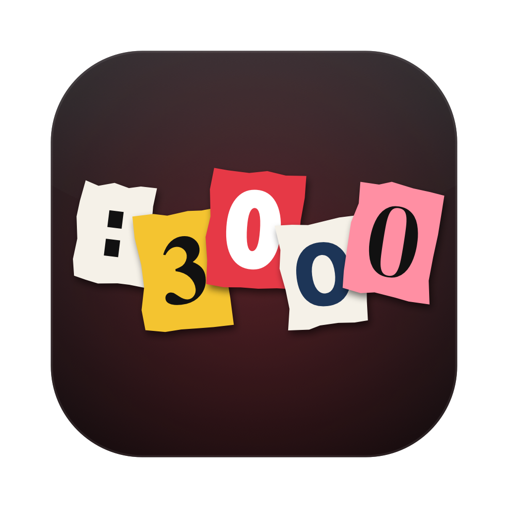

<p align="center"></p>

<h1 align="center">localhostage</h1>
<p align="center"><b>Your ports are being held hostage.</b><br>A tiny macOS menu bar app that shows every dev server on your Mac, and frees the port in one click.</p>

```bash
brew install --cask askmaddyy/tap/localhostage
```

## What it does

- **Every hostage, named.** Port, project, git branch, the real command (`npm run dev`, not `node`), uptime, memory, CPU, and who started it: Claude Code, Codex, Cursor, Ghostty, and so on.
- **Free it properly.** Stops the whole tree, meaning the `npm`/`pnpm` wrapper and everything it spawned, so nothing respawns or leaks. SIGTERM first, SIGKILL after 2s.
- **Run it again.** Freed servers move to *Recently freed*. Hit Run and it starts again in the same folder with the same command. Output goes to `~/Library/Logs/localhostage/`.
- **System stuff is safe.** macOS processes, databases (Postgres, Redis, Mongo, MySQL), and Docker are skipped by *Kill all*, and killing one individually needs a second click.
- **Quiet by default.** macOS daemons and GUI-app helpers (AirPlay, Spotify...) are hidden. Toggle *Show system servers* to see everything.
- **Light.** Reads sockets straight from `libproc`, with no `lsof` and no subprocesses. A full scan takes ~10ms, and idle CPU is 0%.

Built with SwiftUI and Liquid Glass on macOS 26, with a frosted fallback on macOS 14-15.

## Privacy

Nothing leaves your Mac. To support Run, localhostage keeps each server's folder, command, and a short allowlist of environment variables (`PATH`, `HOME`, `NODE_ENV`, `PORT`...). It never stores secrets or API keys from your environment.

macOS may ask once for access to Desktop, Documents, or Downloads. That access is only used to read each project's `.git/HEAD` for the branch label, and to start servers there when you press Run. If you decline, everything else still works.

## Why not the Mac App Store?

App Store apps must be sandboxed, and the sandbox blocks reading other apps' sockets and stopping other processes, which is the whole app. That's why it ships through Homebrew, signed and notarized.

## Build from source

```bash
swift build                     # debug
scripts/build.sh                # signed build/localhostage.app
swiftc Sources/Scanner.swift Tests/main.swift -o /tmp/localhostage-check && /tmp/localhostage-check
```

MIT licensed.
